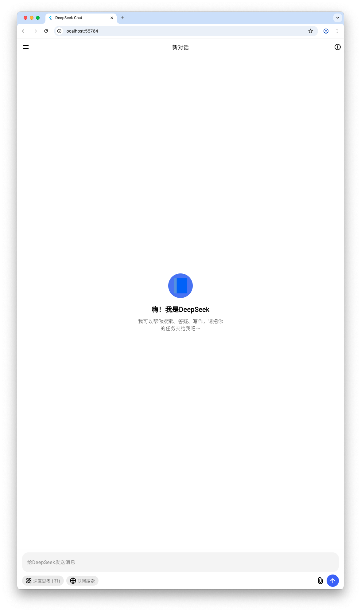

# Chat Flutter

一个基于Flutter开发的现代化AI聊天应用程序，UI界面参考了Deepseek的设计，后端使用Dify API，提供流畅的用户体验和丰富的功能。

## 界面预览



主要特点：
- 简洁现代的界面设计
- 清晰的对话展示
- 便捷的文件上传
- 流畅的交互体验

## 功能特点

- Deepseek风格的现代化UI设计
- 支持文本消息发送和接收
- 文件上传和预览功能
- 深度思考模式展示
- 消息复制和编辑功能
- 响应式布局设计
- 基于Dify的AI对话能力
- 支持多轮对话上下文

## 技术栈

- 前端：Flutter
- 后端：Dify API
- 状态管理：Provider
- 网络请求：Dio
- UI组件：Material Design

## 开发环境要求

- Flutter SDK
- Dart SDK
- IDE (推荐使用 VS Code 或 Android Studio)
- Dify API Key

## 安装说明

1. 克隆项目到本地：
```bash
git clone [项目地址]
```

2. 进入项目目录：
```bash
cd chat_flutter
```

3. 安装依赖：
```bash
flutter pub get
```

4. 配置Dify API：
   - 在Dify平台获取API Key
   - 在项目配置文件中设置API Key

5. 运行项目：
```bash
flutter run
```

## 项目结构

```
lib/
├── main.dart              # 应用程序入口
├── models/               # 数据模型
│   ├── conversations.dart  # 会话模型
│   ├── message_file.dart   # 文件消息模型
│   └── message_history.dart # 消息历史模型
├── utils/               # 工具类
│   ├── config.dart        # 配置文件
│   ├── dio_service.dart   # 网络请求服务
│   └── service_utils.dart # 工具方法
└── widgets/             # UI组件
    ├── app_drawer.dart    # 应用抽屉组件
    ├── conversation_body.dart  # 会话主体
    ├── file_body.dart     # 文件展示组件
    ├── message_body.dart  # 消息主体组件
    ├── query_editor.dart  # 消息输入组件
    └── welcome.dart       # 欢迎页面
```

## 使用的主要依赖

- flutter_markdown: Markdown渲染
- flutter_svg: SVG图标支持
- file_picker: 文件选择功能
- provider: 状态管理
- dio: 网络请求
- shared_preferences: 本地存储

## 主要功能说明

1. 聊天界面
   - 支持多轮对话
   - 支持代码高亮显示
   - 支持Markdown渲染
   - 支持文件上传和预览

2. 会话管理
   - 支持创建新会话
   - 支持切换历史会话
   - 支持会话重命名
   - 支持会话删除

3. 文件处理
   - 支持多文件上传
   - 支持文件预览
   - 支持文件删除

## 贡献指南

1. Fork 项目
2. 创建特性分支 (`git checkout -b feature/AmazingFeature`)
3. 提交更改 (`git commit -m 'Add some AmazingFeature'`)
4. 推送到分支 (`git push origin feature/AmazingFeature`)
5. 开启 Pull Request

## 许可证

本项目采用 MIT 许可证 - 查看 [LICENSE](LICENSE) 文件了解详情
